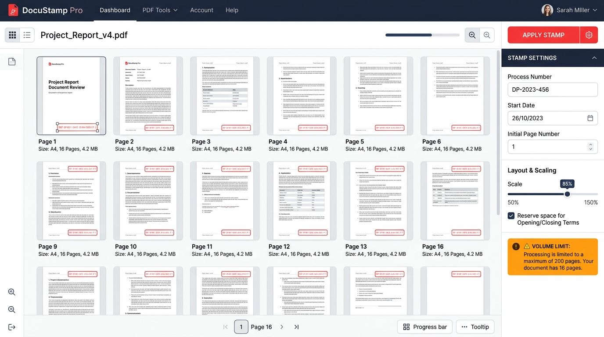

# SIGFolha - Carimbador Dinâmico de PDF

O **SIGFolha** é um processador digital em lote (Batch Processor) de alta performance projetado para automatizar a carimbagem vetorial e a numeração sequencial de folhas em documentos PDF. Ele foi desenvolvido com o foco em **atrito zero** e interface moderna inspirada nas melhores práticas de design (Charm Design System).

O software funciona de duas formas:
1. **Local (Desktop):** Como um executável portátil único (`.exe`) para Windows 11.
2. **Nuvem (Web):** Pronto para ser implantado no Railway ou qualquer outro ambiente de contêineres Docker.

---

## 📸 Mockup da Interface
O design visual do sistema segue o mockup abaixo (salvo no repositório):


---

## 🚀 Funcionalidades Principais

*   **Processamento em Lote (Batch):** Envio simultâneo de múltiplos PDFs com mesclagem e numeração contínua automática de ponta a ponta na fila.
*   **Reordenação por Arrasto:** Painel esquerdo interativo que permite reordenar os arquivos na fila por drag-and-drop.
*   **Seleção de Intervalos de Página:** Controle granular por arquivo (ex: "Todos", "1-5", "2, 4, 6-10") para carimbar apenas as páginas necessárias.
*   **Carimbo Vetorial Century Gothic:**
    *   Desenho estritamente vetorial utilizando comandos nativos do PyMuPDF, garantindo qualidade infinita de impressão (sem pixelização).
    *   Utiliza a fonte **Century Gothic Bold** (tamanho 8 para todos os campos) registrada localmente a partir de arquivos `.ttf`.
    *   Contorno preto fino com 1.2 pt de espessura.
    *   Formato da numeração de folha sem espaços: `Fl.18`.
*   **Controle Dinâmico de Rotação:** O motor matemático aplica uma matriz de derotação (`derotation_matrix`) para que os carimbos fiquem perfeitamente alinhados no canto superior direito de cada página, mesmo em documentos com orientações mistas (paisagem/retrato) ou páginas rotacionadas.
*   **Regra de Volumes e Termos de Abertura/Encerramento:**
    *   Pula automaticamente a inserção do carimbo nas páginas de termos de abertura/encerramento (múltiplos do limite de volume, ex: 200, 400 e múltiplos + 1, ex: 201, 401).
    *   A sequência numérica pula essas páginas de forma inteligente (ex: pág. 199 -> pula 200 e 201 -> pág. 202).
    *   Avisos visuais na tela são exibidos imediatamente caso a numeração atinja ou exceda limites de quebras de volume.
*   **Interface Interativa com Desfazer/Refazer (Undo/Redo):**
    *   Permite arrastar o carimbo em tempo real e redimensioná-lo puxando os cantos da caixa com o mouse (ajustando a escala proporcional de forma visual).
    *   Suporta modo **Global** (todas as páginas juntas) ou **Customizado** (ajuste por página).
    *   Histórico completo de Undo/Redo no frontend com atalhos de teclado (`Ctrl+Z` / `Ctrl+Y`).
*   **Performance com Lazy Loading:** O frontend renderiza miniaturas leves das páginas do PDF sob demanda usando `IntersectionObserver`, economizando recursos do navegador em PDFs pesados ou escaneados.

---

## 🛠️ Estrutura do Repositório

```
carimbo-pdf/
├── requirements.txt         # Dependências do projeto (FastAPI, PyMuPDF, PyInstaller)
├── Dockerfile               # Configuração leve para Docker e Railway
├── build_desktop.py         # Script Python para empacotar o executável do Windows
├── app/
│   ├── main.py              # Inicialização do FastAPI e definição das rotas da API
│   ├── core/
│   │   ├── config.py        # Configurações globais e padrões do carimbo
│   │   └── pdf_processor.py # Algoritmo de sequenciamento e desenho vetorial (PyMuPDF)
│   ├── fonts/               # Arquivos Century Gothic TrueType (.ttf) para embarque vetorial
│   └── templates/
│       └── index.html       # Single Page Application (Charm Design System)
├── tests/
│   ├── test_pdf_processor.py # Testes unitários do motor PyMuPDF e cálculo de sequenciamento
│   └── test_api.py          # Testes de integração de endpoints da API
└── mockups/
    └── gui_reference.jpg    # Mockup visual de referência
```

---

## 💻 Inicialização e Execução Local

### Pré-requisitos
*   Python 3.12+ instalado na máquina.

### Passos para Rodar o Servidor
1.  Instale as dependências:
    ```bash
    pip install -r requirements.txt
    ```
2.  Inicie o servidor de desenvolvimento:
    ```bash
    uvicorn app.main:app --reload
    ```
3.  Abra o navegador em `http://localhost:8000`.

---

## 🧪 Executando a Suíte de Testes
Para garantir a integridade dos cálculos matemáticos de escala, pulos de termos e rotas de API, execute o comando:
```bash
python -m pytest
```

---

## 📦 Empacotando para Desktop (.exe)
Para compilar o aplicativo completo em um único executável portátil do Windows (que roda sem necessitar do Python instalado):
```bash
python build_desktop.py
```
O executável final estará disponível na pasta `dist/SIGFolha.exe`. Ele embutirá automaticamente o servidor FastAPI, o motor PyMuPDF, a interface SPA e os arquivos de fontes Century Gothic.

---

## 🤖 Contexto Técnico para IAs (Developer & AI Context)

> [!NOTE]
> Esta seção foi projetada para que futuros assistentes de IA (copilotos de código) compreendam a arquitetura e as regras críticas de design ao fazer alterações no repositório.

### 📌 Decisões de Arquitetura Importantes
1.  **Compatibilidade com PDFs Rotacionados (Crucial):**
    *   No PyMuPDF, páginas de PDF podem ter propriedades de rotação (`page.rotation` em múltiplos de 90). Para desenhar elementos gráficos e textos sem que fiquem distorcidos ou invertidos, aplicamos a matriz de derotação (`page.derotation_matrix`) a todos os pontos e retângulos do desenho:
        `fitz.Rect(x0, y0, x1, y1) * derot`
        `fitz.Point(px, py) * derot`
    *   O texto é inserido utilizando o parâmetro `rotate=page.rotation` para acompanhar a orientação visual da página.
2.  **Otimização de PDFs Escaneados / Grandes:**
    *   Não converta o PDF inteiro para imagens no backend. Isso causa estouro de memória (OOM). A rota `/api/preview/{file_id}/{page_idx}` renderiza as páginas sob demanda, e o frontend consome essa rota via `IntersectionObserver` apenas para as páginas visíveis na janela de exibição.
3.  **Registro de Fonte Customizada (Century Gothic):**
    *   Para garantir consistência vetorial sem depender de fontes instaladas no sistema operacional do usuário, os arquivos `.ttf` estão no diretório `/app/fonts/`.
    *   O PyMuPDF carrega a fonte local passando o caminho do arquivo `fontfile=font_bold_path` na chamada de `insert_text()`.
4.  **Pilha de Histórico de Undo/Redo Leve:**
    *   Para evitar lentidão e consumo de memória ao carregar múltiplos arquivos pesados, a pilha de histórico do frontend armazena apenas dados de transformações geométricas (`scale`, `positionMode`, `globalCoords`, `customCoords`) como snapshots simples em formato de dicionários JSON, em vez de estados inteiros da UI.
